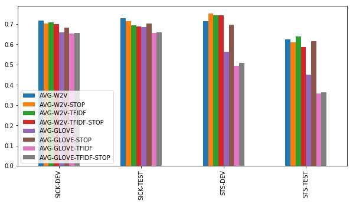

# text2vec
[](https://badge.fury.io/py/text2vec)
[](CONTRIBUTING.md)
[](https://github.com/shibing624/text2vec/graphs/contributors)
[](LICENSE)
[](requirements.txt)
[](https://github.com/shibing624/text2vec/issues)
[](#Contact)

text2vec, chinese text to vector.(文本向量化表示工具，包括：词向量化表示，句子向量化表示，长文本向量化表示，文本相似度计算。)


# Feature
#### 文本向量表示
- 字词粒度，通过腾讯AI Lab开源的大规模高质量中文[词向量数据（800万中文词轻量版）](https://pan.baidu.com/s/1La4U4XNFe8s5BJqxPQpeiQ) (文件名：light_Tencent_AILab_ChineseEmbedding.bin 密码: tawe），获取字词的word2vec向量表示。
- 句子粒度，通过求句子中所有单词词向量的平均值计算得到。
- 篇章粒度，可以通过gensim库的doc2vec得到，应用较少，本项目不实现。

#### 文本相似度计算

- 基准方法，估计两句子间语义相似度最简单的方法就是求句子中所有单词词向量的平均值，然后计算两句子词向量之间的余弦相似性。
- 词移距离（Word Mover’s Distance），词移距离使用两文本间的词向量，测量其中一文本中的单词在语义空间中移动到另一文本单词所需要的最短距离。

#### query和docs的相似度比较
- rank_bm25方法，使用bm25的变种算法，对query和文档之间的相似度打分，得到docs的rank排序。

## 调研结论

#### 文本相似度计算
- 基准方法

尽管文本相似度计算的基准方法很简洁，但用平均词向量之间求余弦相似度的表现非常好。实验有以下结论：

    1. 简单word2vec向量比GloVe向量表现的好
    2. 在用word2vec时，尚不清楚使用停用词表或TF-IDF加权是否更有帮助。在STS数据集上，有一点儿帮助；在SICK上没有帮助。
    仅计算未加权的所有word2vec向量平均值表现得很好。
    3. 在使用GloVe时，停用词列表对于达到好的效果非常重要。利用TF-IDF加权没有帮助。




- 词移距离

基于我们的结果，好像没有什么使用词移距离的必要了，因为上述方法表现得已经很好了。只有在STS-TEST数据集上，而且只有在有停止词列表的情况下，词移距离才能和简单基准方法一较高下。


# Demo

http://42.193.145.218/product/short_text_sim/

# Install
```
pip3 install text2vec
```

or

```
git clone https://github.com/shibing624/text2vec.git
cd text2vec
python3 setup.py install
```

# Usage

1. 下载预训练词向量文件

以下词向量，任选一个：

- 轻量版腾讯词向量 [百度云盘-密码:tawe](https://pan.baidu.com/s/1La4U4XNFe8s5BJqxPQpeiQ) 或 [谷歌云盘](https://drive.google.com/u/0/uc?id=1iQo9tBb2NgFOBxx0fA16AZpSgc-bG_Rp&export=download)，二进制，111MB放到 `~/.text2vec/datasets/light_Tencent_AILab_ChineseEmbedding.bin`

- [腾讯词向量-官方全量](https://ai.tencent.com/ailab/nlp/data/Tencent_AILab_ChineseEmbedding.tar.gz), 6.78G放到： `~/.text2vec/datasets/Tencent_AILab_ChineseEmbedding.txt`


2. 文本向量计算

- 基于预训练的word2vec计算文本向量

通过腾讯词向量计算各字词的词向量，句子向量通过单词词向量取平均值得到。

示例[computing_embeddings.py](./examples/computing_embeddings.py)

```python
import sys

sys.path.append('..')
from text2vec import SBert
from text2vec import Word2Vec


def compute_emb(model):
    # Embed a list of sentences
    sentences = ['卡',
                 '银行卡',
                 '如何更换花呗绑定银行卡',
                 '花呗更改绑定银行卡',
                 'This framework generates embeddings for each input sentence',
                 'Sentences are passed as a list of string.',
                 'The quick brown fox jumps over the lazy dog.']
    sentence_embeddings = model.encode(sentences)

    print(type(sentence_embeddings), sentence_embeddings.shape)

    # The result is a list of sentence embeddings as numpy arrays
    for sentence, embedding in zip(sentences, sentence_embeddings):
        print("Sentence:", sentence)
        print("Embedding:", embedding)
        print("")


sbert_model = SBert('paraphrase-multilingual-MiniLM-L12-v2')
compute_emb(sbert_model)

w2v_model = Word2Vec('w2v-light-tencent-chinese')
compute_emb(w2v_model)
```

output:
```
<class 'numpy.ndarray'> (7, 384)
Sentence: 卡
Embedding: [ 1.39491949e-02  8.62287879e-02 -1.35622978e-01 ... ]
Sentence: 银行卡
Embedding: [ 0.06216322  0.2731747  -0.6912158 ... ]
```
> 返回值`embeddings`是`numpy.ndarray`类型，shape为`(sentence_size, model_embedding_size)`

`SBert`是`sentence-bert`模型计算的句子向量结果；
`Word2Vec`是腾讯词向量计算单词向量取平均结果。

- 计算句子之间的相似度值

示例[semantic_text_similarity.py](./examples/semantic_text_similarity.py)

```
import sys

sys.path.append('..')
from text2vec import SBert
from sentence_transformers.util import cos_sim

# Load pre-trained Sentence Transformer Model (based on DistilBERT). It will be downloaded automatically
model = SBert('paraphrase-multilingual-MiniLM-L12-v2')

# Two lists of sentences
sentences1 = ['如何更换花呗绑定银行卡',
              'The cat sits outside',
              'A man is playing guitar',
              'The new movie is awesome']

sentences2 = ['花呗更改绑定银行卡',
              'The dog plays in the garden',
              'A woman watches TV',
              'The new movie is so great']

# Compute embedding for both lists
embeddings1 = model.encode(sentences1)
embeddings2 = model.encode(sentences2)

# Compute cosine-similarits
cosine_scores = cos_sim(embeddings1, embeddings2)

# Output the pairs with their score
for i in range(len(sentences1)):
    print("{} \t\t {} \t\t Score: {:.4f}".format(sentences1[i], sentences2[i], cosine_scores[i][i]))
```

output:
```
如何更换花呗绑定银行卡 		 花呗更改绑定银行卡 		 Score: 0.9477
The cat sits outside 		 The dog plays in the garden 		 Score: 0.1908
A man is playing guitar 		 A woman watches TV 		 Score: 0.0055
The new movie is awesome 		 The new movie is so great 		 Score: 0.9591
```

> 句子相似度值范围在0到1之间，值越大越相似。

- 计算句子与文档集之间的相似度值

一般在文档候选集中找与query最相似的文本，常用于QA场景的问句相似匹配任务。


示例[semantic_search.py](./examples/semantic_search.py)

```
import sys

sys.path.append('..')
from text2vec import SBert
from sentence_transformers.util import cos_sim, semantic_search

embedder = SBert()

# Corpus with example sentences
corpus = [
    '花呗更改绑定银行卡',
    '我什么时候开通了花呗',
    'A man is eating food.',
    'A man is eating a piece of bread.',
    'The girl is carrying a baby.',
    'A man is riding a horse.',
    'A woman is playing violin.',
    'Two men pushed carts through the woods.',
    'A man is riding a white horse on an enclosed ground.',
    'A monkey is playing drums.',
    'A cheetah is running behind its prey.'
]
corpus_embeddings = embedder.encode(corpus)

# Query sentences:
queries = [
    '如何更换花呗绑定银行卡',
    'A man is eating pasta.',
    'Someone in a gorilla costume is playing a set of drums.',
    'A cheetah chases prey on across a field.']

for query in queries:
    query_embedding = embedder.encode(query)
    hits = semantic_search(query_embedding, corpus_embeddings, top_k=5)
    print("\n\n======================\n\n")
    print("Query:", query)
    print("\nTop 5 most similar sentences in corpus:")
    hits = hits[0]  # Get the hits for the first query
    for hit in hits:
        print(corpus[hit['corpus_id']], "(Score: {:.4f})".format(hit['score']))
```

> 'score'的结果越大，表示该query与corpus的相似度越近。


# Contact

- Issue(建议)：[](https://github.com/shibing624/text2vec/issues)
- 邮件我：xuming: xuming624@qq.com
- 微信我：
加我*微信号：xuming624, 备注：个人名称-NLP* 进NLP交流群。


# Cite

如果你在研究中使用了text2vec，请按如下格式引用：

```latex
@software{text2vec,
  author = {Xu Ming},
  title = {text2vec: A Tool for Text to Vector},
  year = {2021},
  url = {https://github.com/shibing624/text2vec},
}
```

# License


授权协议为 [The Apache License 2.0](/LICENSE)，可免费用做商业用途。请在产品说明中附加text2vec的链接和授权协议。


# Contribute
项目代码还很粗糙，如果大家对代码有所改进，欢迎提交回本项目，在提交之前，注意以下两点：

 - 在`tests`添加相应的单元测试
 - 使用`python setup.py test`来运行所有单元测试，确保所有单测都是通过的

之后即可提交PR。

# Reference

1. [将句子表示为向量（上）：无监督句子表示学习（sentence embedding）](https://www.cnblogs.com/llhthinker/p/10335164.html)
2. [将句子表示为向量（下）：无监督句子表示学习（sentence embedding）](https://www.cnblogs.com/llhthinker/p/10341841.html)
3. [A Simple but Tough-to-Beat Baseline for Sentence Embeddings[Sanjeev Arora and Yingyu Liang and Tengyu Ma, 2017]](https://openreview.net/forum?id=SyK00v5xx)
4. [四种计算文本相似度的方法对比[Yves Peirsman]](https://zhuanlan.zhihu.com/p/37104535)
5. [Improvements to BM25 and Language Models Examined](http://www.cs.otago.ac.nz/homepages/andrew/papers/2014-2.pdf)
